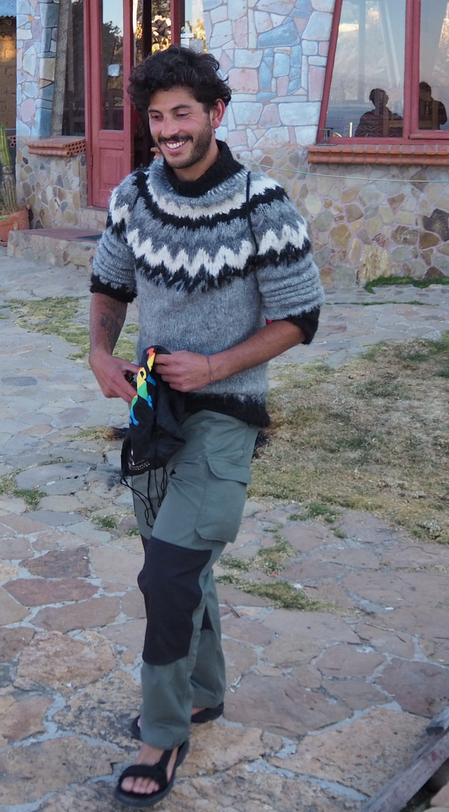

# About

Hi! I am Lorenzo and I am a third-year PhD student at [BARC](https://barc.ku.dk/){:target="_blank"}, University of Copenhagen.
I am fortunate to be advised by [Mikkel Thorup](http://hjemmesider.diku.dk/~mthorup/){:target="_blank"} 
and [Mikkel Abrahamsen](https://sites.google.com/view/mikkel-abrahamsen){:target="_blank"}.

I am broadly interested in Theoretical Computer Science, with a particular emphasis on sublinear algorithms 
and algorithms for (geo)metric problems.

### **I'm looking for a job!** Please, reach out if you wanna hire me for a PostDoc ([Full CV](pdfs/CV.pdf){:target="_blank"}).

# Papers
1. **Min-Weight Bipartite Matching and Earth-Mover Distance in Sublinear Time**. Lorenzo Beretta and
Aviad Rubinstein. Work in progress.

1. **Multi-Swap k-Means++**. Lorenzo Beretta, Vincent Cohen-Addad, Silvio Lattanzi and Nikos Parotsidis.
Submitted.

1. **Locally Uniform Hashing**. Ioana Bercea, Lorenzo Beretta, Jonas Klausen, Jakob Bæk Tejs Houen
and Mikkel Thorup. 
FOCS 2023.
[arXiv](https://arxiv.org/abs/2308.14134){:target="_blank"}.

1. **Online Sorting and Translational Packing of Convex Polygons**. Anders Aamand, Mikkel Abrahamsen, Lorenzo Beretta and Linda Kleist. 
SODA 2023.
[arXiv](https://arxiv.org/abs/2112.03791){:target="_blank"}.

1. **Better Sum Estimation via Weighted Sampling**. Lorenzo Beretta and Jakub Tetek.
SODA 2022. Best Student Paper Award.
[arXiv](https://arxiv.org/abs/2110.14948){:target="_blank"}.

1. **Online Packing to Minimize Area or Perimeter**. Mikkel Abrahamsen and Lorenzo Beretta. SoCG 2021.
[arXiv](https://arxiv.org/abs/2101.09024){:target="_blank"}.

1. **An Optimal Algorithm to Find Champions of Tournament Graphs**. Lorenzo Beretta, Franco Maria
Nardini, Roberto Trani and Rossano Venturini. IEEE Transactions on Knowledge and Data Engineering 
(TKDE). [arXiv](https://arxiv.org/abs/2111.13621){:target="_blank"}.

# Miscellanea

* Three things that I enojoy: Pesto Lasagna, Mountain Biking and TCS <3 
