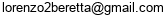

# Lorenzo Beretta

<!--  -->

Hi! I am Lorenzo and I am currently a postdoc at University of California, Santa Cruz hosted by [Evangelos Chatziafratis](https://cs.stanford.edu/~vaggos/).
I recently graduated from [BARC](https://barc.ku.dk/), University of Copenhagen, where I was fortunate to be advised by [Mikkel Thorup](http://hjemmesider.diku.dk/~mthorup/) 
and [Mikkel Abrahamsen](https://sites.google.com/view/mikkel-abrahamsen).
During my PhD, I visited [Aviad Rubinstein](https://cs.stanford.edu/~aviad/) at Stanford and I interned at Google Research, where I worked with [Vincent Cohen-Addad](https://www.di.ens.fr/~vcohen/), [Silvio Lattanzi](https://sites.google.com/site/silviolattanzi/) and [Nikos Parotsidis](https://sites.google.com/view/nikosparotsidis).

# Research Interests

I am interested in the design and analysis of algorithms for massive datasets, including sublinear algorithms, approximation algorithms 
and algorithms for geometric problems.

# Papers
**Sketched Lanczos uncertainty score: a low-memory summary of the Fisher information**. 	Marco Miani, Lorenzo Beretta, Søren Hauberg. \
**NeurIPS 2024**.
[[arXiv](https://arxiv.org/abs/2409.15008)]
[[Code](https://github.com/IlMioFrizzantinoAmabile/uncertainty_quantification)].

**Online sorting and online TSP: randomized, stochastic, and high-dimensional**. 	Mikkel Abrahamsen, Ioana Bercea, Lorenzo Beretta, Jonas Klausen and László Kozma. \
**ESA 2024**.
[[arXiv](https://arxiv.org/abs/2406.19257)].

**Approximate Earth Mover's Distance in Truly-Subquadratic Time**. Lorenzo Beretta and
Aviad Rubinstein. \
**STOC 2024**.
[[arXiv](https://arxiv.org/abs/2310.19514)].

**Multi-Swap k-Means++**. Lorenzo Beretta, Vincent Cohen-Addad, Silvio Lattanzi and Nikos Parotsidis.\
**NeurIPS 2023**.
[[arXiv](https://arxiv.org/abs/2309.16384)]
[[Code](https://github.com/lorenzo2beretta/multi-swap-k-means-pp)].

**Locally Uniform Hashing**. Ioana Bercea, Lorenzo Beretta, Jonas Klausen, Jakob Bæk Tejs Houen
and Mikkel Thorup. \
**FOCS 2023**.
[[arXiv](https://arxiv.org/abs/2308.14134)].

**Online Sorting and Translational Packing of Convex Polygons**. Anders Aamand, Mikkel Abrahamsen, Lorenzo Beretta and Linda Kleist. \
**SODA 2023**.
[[arXiv](https://arxiv.org/abs/2112.03791)].

**Better Sum Estimation via Weighted Sampling**. Lorenzo Beretta and Jakub Tetek.\
**SODA 2022**.  **Best Student Paper Award**. **TALG special issue.**
[[arXiv](https://arxiv.org/abs/2110.14948)].

**Online Packing to Minimize Area or Perimeter**. Mikkel Abrahamsen and Lorenzo Beretta. \
**SoCG 2021**.
[[arXiv](https://arxiv.org/abs/2101.09024)].

**An Optimal Algorithm to Find Champions of Tournament Graphs**. Lorenzo Beretta, Franco Maria
Nardini, Roberto Trani and Rossano Venturini. \
**TKDE** (IEEE Transactions on Knowledge and Data Engineering). [[arXiv](https://arxiv.org/abs/2111.13621)].
