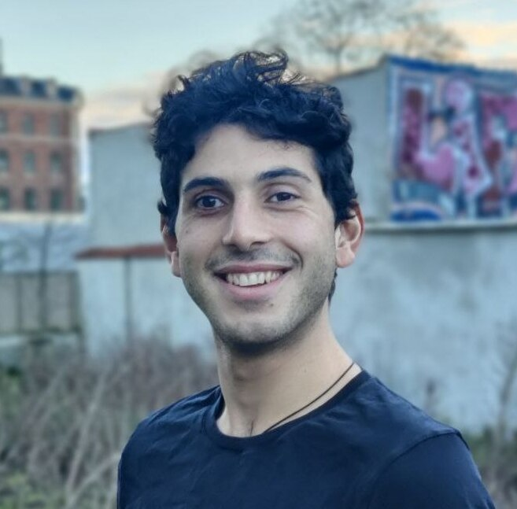

# Lorenzo Beretta

Hi! I am Lorenzo and I am currently a postdoc at University of California, Santa Cruz hosted by [Vaggos Chatziafratis](https://cs.stanford.edu/~vaggos/).
I recently graduated from [BARC](https://barc.ku.dk/), University of Copenhagen, where I was fortunate to be advised by [Mikkel Thorup](http://hjemmesider.diku.dk/~mthorup/) 
and [Mikkel Abrahamsen](https://sites.google.com/view/mikkel-abrahamsen).
During my PhD, I visited [Aviad Rubinstein](https://cs.stanford.edu/~aviad/) at Stanford and I interned at Google Research, where I worked with [Vincent Cohen-Addad](https://www.di.ens.fr/~vcohen/), [Silvio Lattanzi](https://sites.google.com/site/silviolattanzi/) and [Nikos Parotsidis](https://sites.google.com/view/nikosparotsidis).

# Research Interests

I am interested in the design and analysis of algorithms for massive datasets, including sublinear algorithms, approximation algorithms 
and algorithms for geometric problems.

# Papers
- [**Approximating High-Dimensional Earth Mover’s Distance as Fast as Closest Pair**](pdfs/Closest_Pair_for_Subquadratic_EMD.pdf) 	\
Lorenzo Beretta, vincent Cohen-Addad, Rajesh Jayaram, Erik Waingarten \

- [**Testing Juntas Optimally with Samples**](https://arxiv.org/abs/2505.04604) 	\
Lorenzo Beretta, Nathaniel Harms, Caleb Koch \

- [**New Statistical and Computational Results for Learning Junta Distributions**](https://arxiv.org/abs/2505.05819) 	\
Lorenzo Beretta\

- [**Sketched Lanczos uncertainty score: a low-memory summary of the Fisher information**](https://arxiv.org/abs/2409.15008) 	\
Marco Miani, Lorenzo Beretta, Søren Hauberg \
**NeurIPS 2024**
[[Code](https://github.com/IlMioFrizzantinoAmabile/uncertainty_quantification)]

- [**Online sorting and online TSP: randomized, stochastic, and high-dimensional**](https://arxiv.org/abs/2406.19257) 	\
Mikkel Abrahamsen, Ioana Bercea, Lorenzo Beretta, Jonas Klausen and László Kozma \
**ESA 2024**.
Presented at **HALG 2025**.

- [**Approximate Earth Mover's Distance in Truly-Subquadratic Time**](https://arxiv.org/abs/2310.19514)\
Lorenzo Beretta and Aviad Rubinstein \
**STOC 2024**

- [**Multi-Swap k-Means++**](https://arxiv.org/abs/2309.16384) \
Lorenzo Beretta, Vincent Cohen-Addad, Silvio Lattanzi and Nikos Parotsidis \
**NeurIPS 2023**
[[Code](https://github.com/lorenzo2beretta/multi-swap-k-means-pp)]

- [**Locally Uniform Hashing**](https://arxiv.org/abs/2308.14134) \
Ioana Bercea, Lorenzo Beretta, Jonas Klausen, Jakob Bæk Tejs Houen and Mikkel Thorup \
**FOCS 2023**

- [**Online Sorting and Translational Packing of Convex Polygons**](https://arxiv.org/abs/2112.03791) \
Anders Aamand, Mikkel Abrahamsen, Lorenzo Beretta and Linda Kleist \
**SODA 2023**

- [**Better Sum Estimation via Weighted Sampling**](https://arxiv.org/abs/2110.14948) \
Lorenzo Beretta and Jakub Tetek \
**SODA 2022**,  **Best Student Paper Award**, **Invited to HALG 2022** and **TALG special issue**

- [**Online Packing to Minimize Area or Perimeter**](https://arxiv.org/abs/2101.09024)  \
Mikkel Abrahamsen and Lorenzo Beretta \
**SoCG 2021**

- [**An Optimal Algorithm to Find Champions of Tournament Graphs**](https://arxiv.org/abs/2111.13621) \
Lorenzo Beretta, Franco Maria Nardini, Roberto Trani and Rossano Venturini \
**TKDE** (IEEE Transactions on Knowledge and Data Engineering) 
